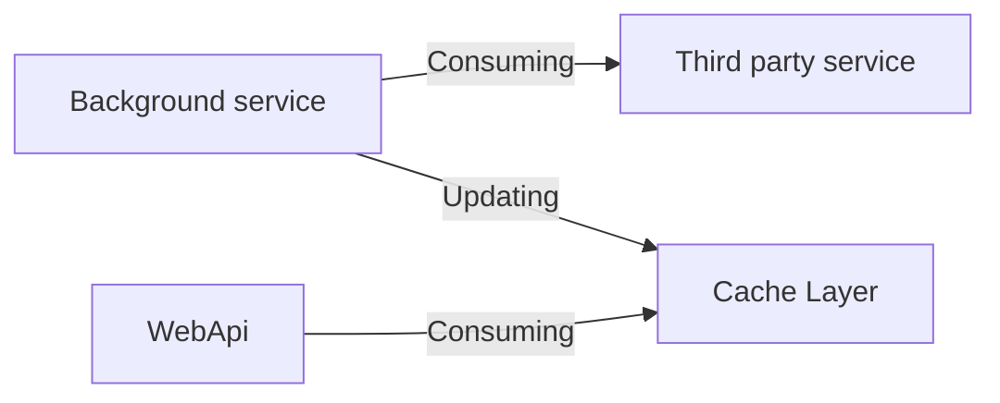

# webapi-with-background-task

Web api consuming cache layer updated by background service.

```mermaid
flowchart  LR

    A[Third party service]
    B[Background service] --> |Consuming| A
    C[Cache Layer]
    B --> |Updating| C
    D[WebApi] --> |Consuming| C 


```